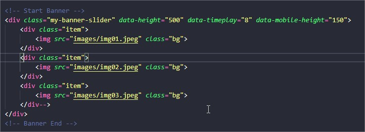

<h1>Banner rotativo</h1>

<a href="https://jsfiddle.net/ByakkoKa/jam9xL50/4/" target="new">Veja aqui</a>

<a href="https://github.com/ByakkoKa/JS-Plugins/raw/master/BannerSlider/BannerSlider.zip">Clique aqui para baixar o plugin</a>

<h2>Como usar:</h2>

<h3>Na DIV pai</h3>

Colocar a classe: "my-banner-slide" e o atributo "data-height"(altura) são obrigatórios.

Os atributos "data-timeplay" "data-mobile-height", são opcionais e controlam o tempo para o slider mudar e a altura em dispositivos móveis respectivamente.

<h3>Nas DIVs filhos</h3>

Cada filho é definido por uma DIV com a classe "item": "div class="item"

Uma imagem com o atributo class="bg", define que a mesma irá se tornar o background do mesmo slide.

Você pode colocar qualqer conteúdo dentro do slide, eles ficam a critério do utilizador.

